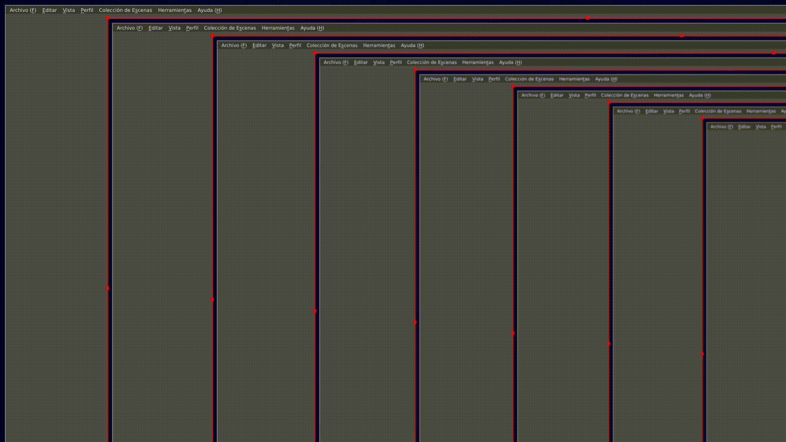

# phpMyAdmin-RCE
Se trata de un exploit diseñado para desplegar una webshell en un entorno específico. El presente script fue desarrollado durante un ejercicio de pentesting dirigido a la máquina virtual 'Stapler' de VulnHub. Aunque su explotación se aprovecha de una vulnerabilidad en phpMyAdmin, el script está ajustado para atacar exclusivamente dicho entorno. Para utilizarlo en un contexto diferente, se requerirían modificaciones selectas.

